# 自動プレゼンテーションタイマー
## 仕様について
|機器 |型番 |価格 |URL |
|-------|------------|---------|--------------|
|マイコン |Raspberry Pi Pico |770円 |https://akizukidenshi.com/catalog/g/g116132/ |
|電池BOX |BH-361B　|100円 |https://akizukidenshi.com/catalog/g/g101224/　|
|ディスプレイ |SC1602BSLB-XA-GB-K　|980円(購入済み) |https://akizukidenshi.com/catalog/g/g100038/　|


## 開発環境について
### 仮想環境の導入方法
```
source .venv/bin/activate
```


### ライブラリのインストール
```
pip install -r requirements.txt
```


### VS Code の拡張機能のインストール
1. MicroPico のインストール
VS Code の 拡張機能 をクリックし、 micropico と入力して検索します。<br>
インストール をクリックして、拡張機能をインストールします。
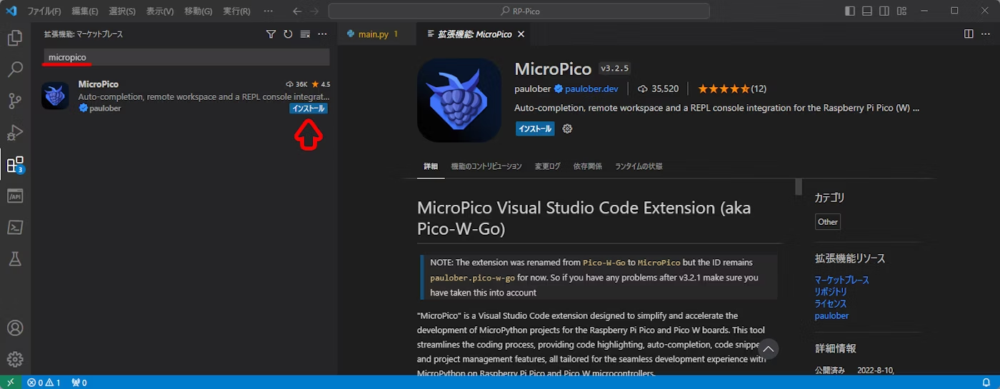

2. MicroPico の初期設定
VS Code の 表示(V) → コマンドパレット をクリックします。<br>
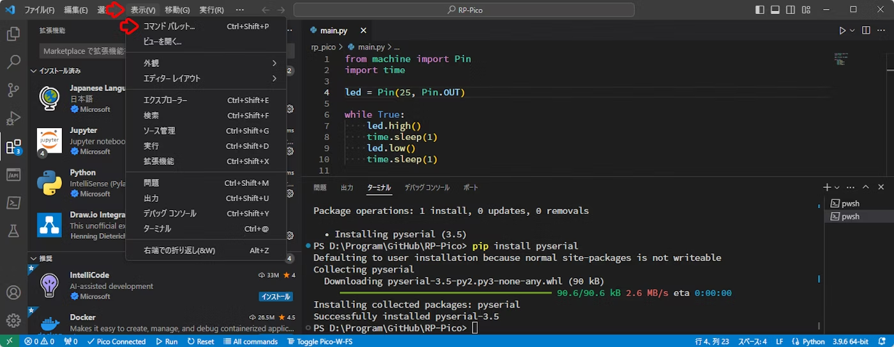
MicroPico: Configure project と入力して Enter キー を押下します。
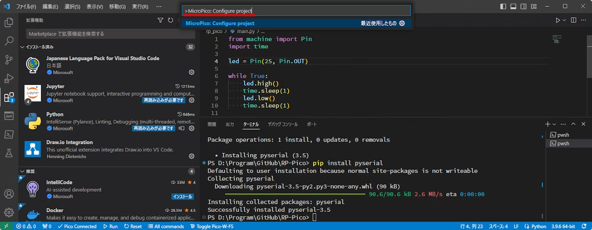

参考資料は以下に示す<br>
https://qiita.com/IoriGunji/items/ebe6cefd3562639f7ca2


### Raspberry Pi Pico の準備
1. ファームウェアのダウンロード
Raspberry Pi 財団のサイトからファームウェアをダウンロードします。<br>
Raspberry Pi Pico を選んでください。<br>
https://www.raspberrypi.com/documentation/microcontrollers/micropython.html#drag-and-drop-micropython
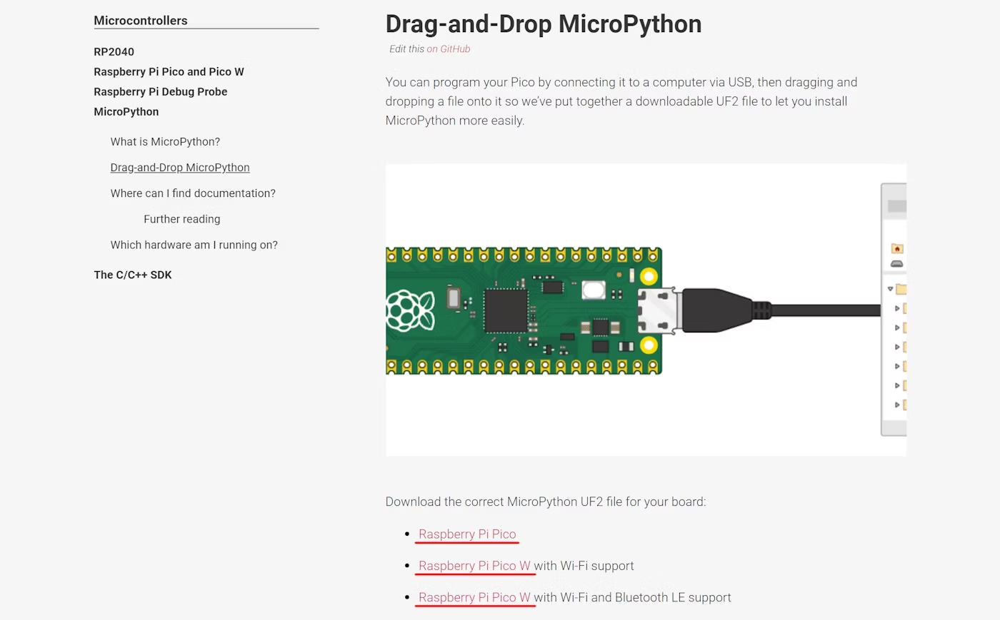

2. ファームウェアの書き込み
Raspberry Pi Pico の BOOTSET ボタンを押しながら、 USB ケーブルで PC に接続します。
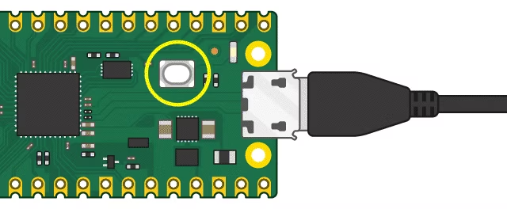
ダウンロードしたファームウェアを RPI-RP2 にドロップします。
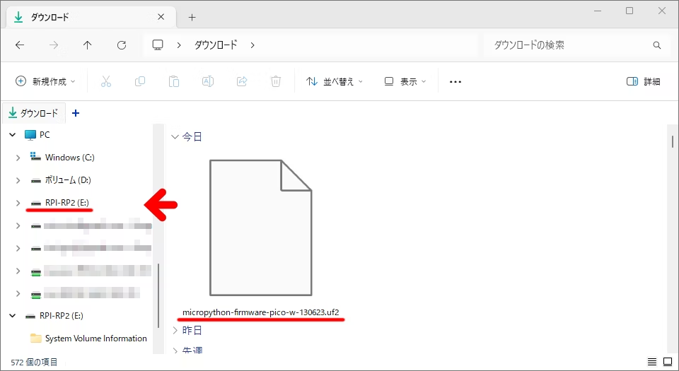
ファームウェアの転送が完了すると、 Raspberry Pi Pico が自動的に再起動します。<br>
以上で、ファームウェアの書き込みは完了です。<br>
以降は USB シリアル通信経由で REPL にアクセスできます。<br>

参考資料は以下に示す<br>
https://qiita.com/IoriGunji/items/ebe6cefd3562639f7ca2


## Python コードの実行準備
Raspberry Pi Pico を USB ケーブルで PC に接続します。（※ BOOTSET ボタンは押しません）<br>
VS Code のステータスバーの Toggle board connection ボタンが Pico Connected になっていることを確認します。
Pico Disconnected になっている場合はクリックして Raspberry Pi Pico に接続します。
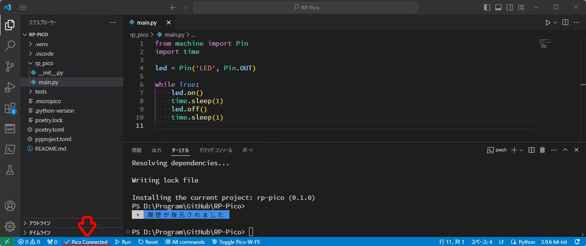
VS Code のステータスバーの Run current file ボタンをクリックして、実行します。
ボタンの表記が Run から Stop に変わります。

Raspberry Pi Pico 本体の LED が点滅することを確認します。
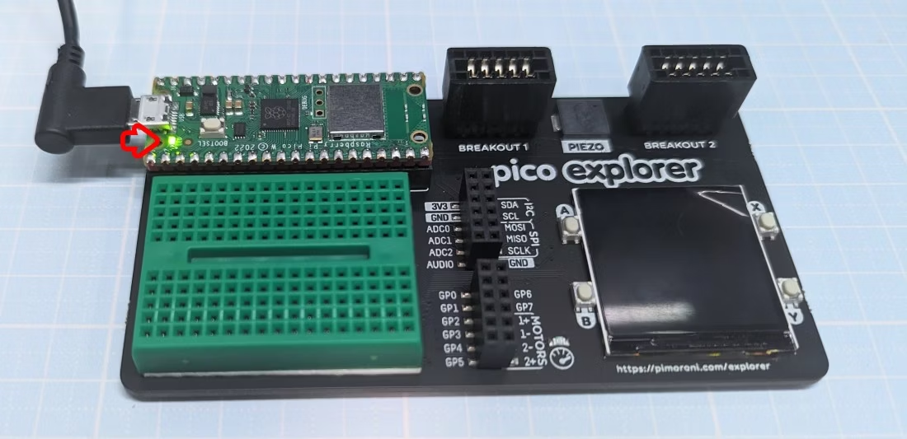
参考資料は以下に示す<br>
https://qiita.com/IoriGunji/items/ebe6cefd3562639f7ca2


## Pythonコードの書き込み
VS Code の 表示(V) をクリックします。
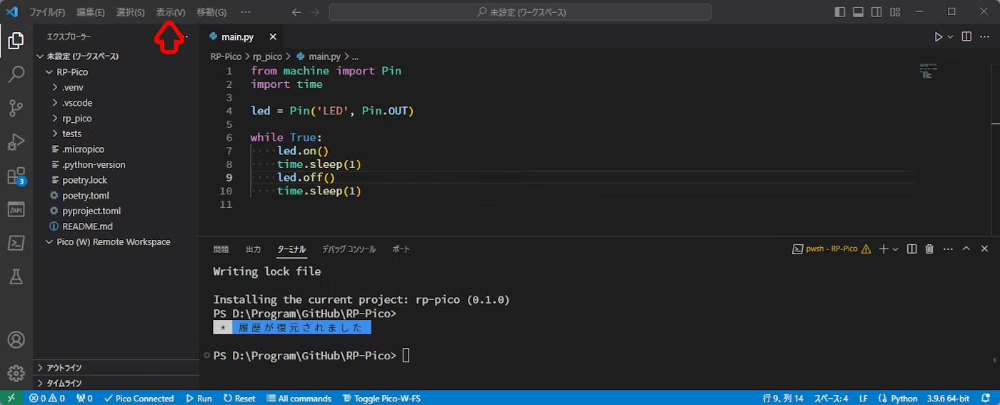
コマンドパレット をクリックします。
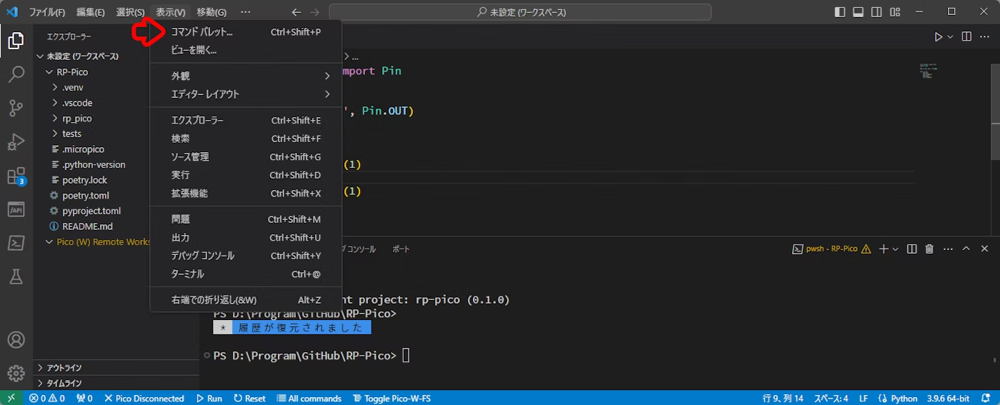
`>MicroPico: Upload current file to Pico` と入力して、 Enter キー を押下します。
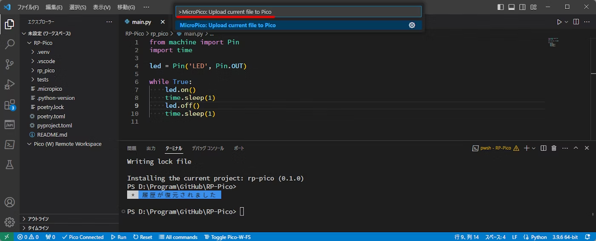
参考資料は以下に示す<br>
https://qiita.com/IoriGunji/items/ebe6cefd3562639f7ca2


## Pythonコードの実行（スタンドアローン）
Raspberry Pi Pico の USB ケーブルを PC から外し、 USB 充電器やモバイルバッテリーなどに接続します。<br>
LED が点滅すれば OK です。<br>
参考資料は以下に示す<br>
https://qiita.com/IoriGunji/items/ebe6cefd3562639f7ca2